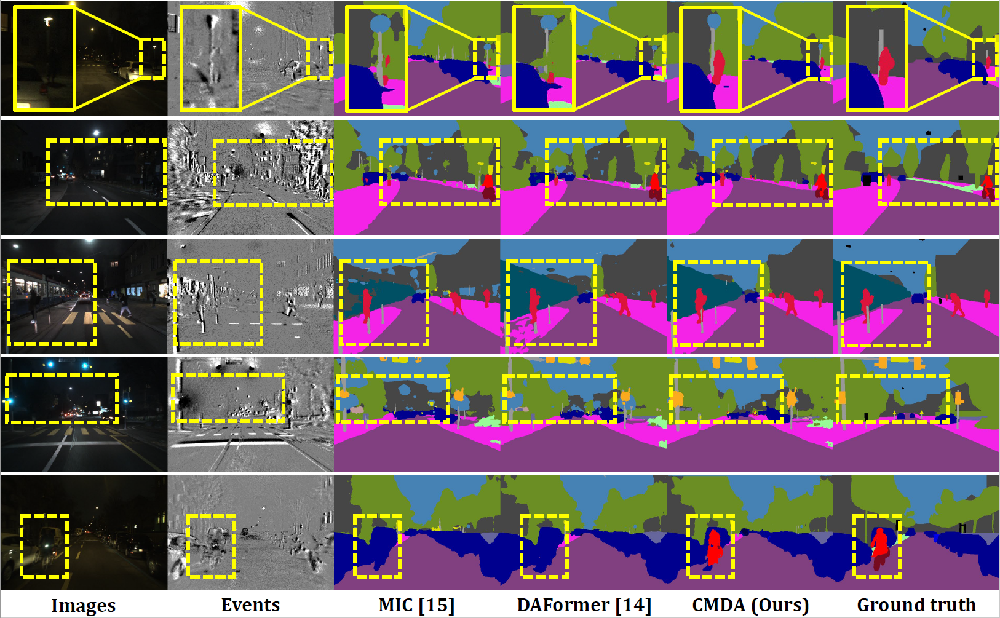
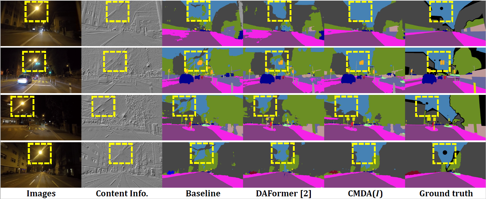
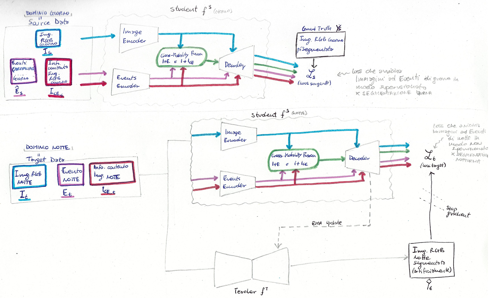
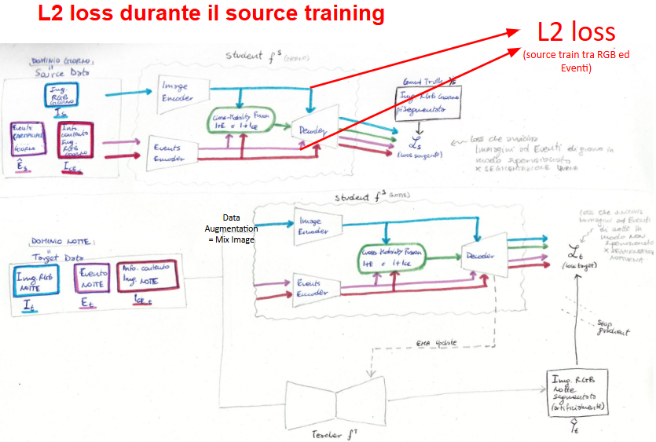

# **<span style="color:purple">Studio di CMDA (Cross-Modality Domain Adaptation) per la Segmentazione Semantica Notturna introducendo nuove loss tra le features</span>**

**di Giovanni Stefanini e Maria Giovanna Donadio**

Articolo di CMDA originale scritto da Ruihao Xia, Chaoqiang Zhao, Meng Zheng, Ziyan Wu, Qiyu Sun, and Yang Tang.
**[[Arxiv]](https://arxiv.org/abs/2307.15942)**
**[[Paper]](https://arxiv.org/pdf/2307.15942.pdf)**


## Panoramica

La maggior parte degli studi sulla segmentazione semantica notturna si basa su approcci di domain adaptation e input di immagini. Tuttavia, limitate dal basso dynamic range delle telecamere convenzionali, le immagini non riescono a catturare i dettagli strutturali e le informazioni di contorno in condizioni di scarsa illuminazione.

Le event camera, come nuova forma di sensori visivi, sono complementari alle telecamere convenzionali grazie al loro alto dynamic range. A questo scopo, nel framework unsupervised di Cross-Modality Domain Adaptation (CMDA) si sfrutta le informazioni multi-modalità (Immagini ed Eventi) per la segmentazione semantica notturna, utilizzando solo le label sulle immagini diurne. Inoltre, viene introdotto il primo dataset per la segmentazione semantica notturna con image-event. 

I punti di forza di CMDA, rispetto ai suoi metodi predecessori UDA state-of-the-art DAFormer, possono essere osservati negli esempi qualitativi del dataset DSEC Night-Semantic.


Anche senza la modalità event, l'Image Content-Extractor mitiga efficacemente l'impatto dei riflessi notturni, risultando in una segmentazione dei bordi più nitida del cielo e di altri oggetti.



## Il nostro contributo
Osservando le prestazioni positive ottenute da CMDA, sono stati condotti ulteriori esperimenti con l’obiettivo di potenziare ulteriormente le capacità di questo framework.

Il contributo di questo lavoro consiste nell’introduzione di diverse varianti di loss L2 applicate alle feature estratte durante la fase di addestramento di CMDA, con lo scopo di migliorare la qualità della segmentazione notturna finale.

Le **loss L2** introdotte nei differenti esperimenti e testate sono le seguenti [RGB = ⚪, EVENT = ⬜, FUSION = 🤍]:

- <span style="color:red">L2 loss tra *RGB features source e EVENT features source*</span>. 🔴

- <span style="color:red">L2 loss tra *RGB features source e EVENT features source*</span> &&
  <span style="color:violet">L2 loss tra *FUSION features source e FUSION features target*</span>. 🔴💜

- <span style="color:violet">L2 loss tra *FUSION features source e FUSION features target*</span>. 💜

- <span style="color:skyblue">L2 loss tra *RGB features source e RGB features target*</span> &&
  <span style="color:blue">L2 loss tra *EVENT features source e RGB features target*</span>. 🔵🟦

- <span style="color:skyblue">L2 loss tra *RGB features source e RGB features target*</span> &&
  <span style="color:green">L2 loss tra *EVENT features source e EVENT features target*</span>. 🔵🟩

|  |  |  |
|:-------------------------------------------:|:-------------------------------------------:|:-------------------------------------------:|
|  |  |  |


## File modificati per gli esperimenti rispetto a CMDA originale

I file principali che sono stati modificati sono:
- file per lanciare la baseline CMDA originale hanno la dicitura **'_originale'** nel nome.
- **'./my_run_experiments.py'** → modificato al fine di avere nell'argparse anche la possibilità di scegliere la backbone
- **'./experiments.py'** → modificato al fine di contenere tutte le possibili backbone mit-b e per modificare il batch_size da 2 (come usato nel paper) a 1, in modo tale da poter essre eseguito su GPU meno potenti.
- **'./mmseg/models/uda/dacs.py'** → per contenere il calcolo delle L2 loss tra le features che vengono estratte. All'interno ci sono tutte le loss L2 implementate, ma sono commentate quelle non utilizzate nell'ultimo esperimento. é il file che viene eseguito durante il train. Per cambiare il tipo di esperimento copiare e incollare al suo interno il dacs della loss che si vuole utilizzare (hanno nomi differenti in base all'esperimento che realizzano).
- **'./configs/fusion/cs2dsec_image+events_together_b2.py'** → modificato per contenere i parametri 'lambda' per le nuove loss. Vanno commentate o decommentate in base all'esperimento che si vuole lanciare.
- **'./configs/_base_/datasets/uda_cityscapes_day_to_dsec_night_512x512.py'** → modificato solo il samples_per_gpu e workers_per_gpu per farlo funzionare.
- **'./my_test.py'** → leggermente modificato per facilitare il lancio dei test.

\
I file che contengono le vaire implementazioni degli esperimenti e che modificano dacs.py sono i seguenti[RGB = ⚪, EVENT = ⬜, FUSION = 🤍]:
- './mmseg/models/uda/dacs_originale.py'
- './mmseg/models/uda/dacs_L2_RGBst_L2_EVENTsRGBt.py' 🔵🟦
- './mmseg/models/uda/dacs_L2_RGBst_L2_EVENTst.py' 🔵🟩
- './mmseg/models/uda/dacs_solo_L2_sourcetarget_fusion.py' 💜
- './mmseg/models/uda/dacs_loss_L2_sourcedomain.py' 🔴


## File aggiunti
Aggiunti alcuni file al fine di poter eseguire con mit_b2:
- './configs/fusion/cs2dsec_image+events_together_b2.py'
- './configs/fusion/cs2dz_image+raw-isr_b2.py'
- './configs/_base_/models/daformer_conv1_mitb2.py'
- './configs/_base_/models/daformer_sepaspp_mitb2.py'

Inoltre nella directory './grafici' sono presenti degli script e le immagini utilizzate per ottenere i grafici delle loss partendo dai log ottenuti dal train.

## Configurazione dell'Ambiente

Per questo progetto, è stato utilizzato python 3.8.5. Raccomandiamo di configurare un nuovo ambiente virtuale:

```shell
conda create -n CMDA-MG python=3.7
conda activate CMDA-MG
```
Dopo aver attivato l'ambiente conda CMDA, aver clonato la repository, entra nella cartella CMDA con il comando:
```shell
cd CMDA/
```
Successivamente eseguire i seguenti passi per installare i requirements:
```shell
pip install -r requirements.txt -f https://download.pytorch.org/whl/torch_stable.html
pip install hdf5plugin
pip install mmcv-full==1.3.7 -f https://download.openmmlab.com/mmcv/dist/cu110/torch1.7.0/index.html # requires the other packages to be installed first
```

Inoltre, scaricare manualmente le pratrained backbone. \
Se si vuole la backbone utilizzata dal paper originale allora scaricare `mit_b5.pth` [MiT-B5](https://drive.google.com/file/d/1TwUh8H9flg-zUHZmq7vu-FtyaSMrf9oq/view?usp=sharing). \
Se si vuole la backbone che è stata utilizzata da noi per lo studio delle loss migliorative allora scaricare `mit_b2.pth` [MiT-B2](https://drive.google.com/drive/u/0/folders/1lnm-omyRB3ZCfpMu5zJPgZT21zQg80RM) dal drive in cui abbiamo raccolto tutte le pretrained trovate.

Scaricare inoltre la rete di style transfer `cityscapes_ICD_to_dsec_EN.pth` 
[qui](https://drive.google.com/file/d/10ZG_fiCvfnhNNppSdPtQhUL9XPTBSIEF/view?usp=sharing). 


Infine, inserire le backbone e la rete di style transfer all'interndo di una cartella `pretrained/` all'interno del  progetto.


## Configurazione dei Dataset

**Cityscapes:** 

① Si prega di scaricare leftImg8bit_trainvaltest.zip e
gt_trainvaltest.zip da [qui](https://www.cityscapes-dataset.com/downloads/)
ed estrarrli in `data/cityscapes`.

② Si prega di scaricare `leftImg8bit_IC1` da [qui](https://drive.google.com/file/d/19474kcmbyz8WRBBez29MOINeQT1yMZyZ/view?usp=sharing)
ed estrarlo in `data/cityscapes`.

③ Infine, si prega di eseguire i seguenti script per convertire gli ID delle label nei train ID e per generare l'indice delle classi per RCS.

```shell
python tools/convert_datasets/cityscapes.py data/cityscapes --nproc 8
```

Da notare che potrebbe essere richiesto di modificare le directory all'interno dei file del progetto al fine di far combaciare i relative path e le working directory.

**DSEC Night_Semantic:** 

Il dataset proposto in CMDA, DSEC Night_Semantic, è composto da 5 sequenze notturne di Zurich City 09a-e e include 1.692 campioni di training e 150 campioni di test. Per ogni campione di test, hanno annotato manualmente 18 classi: Road, Sidewalk, Building, Wall, Fence, Pole, Traffic Light, Traffic Sign, Vegetation, Terrain, Sky, Person, Rider, Car, Bus, Train, Motorcycle e Bicycle.

① Si prega di scaricare events_left.zip e images_rectified_left.zip in `zurich_city_09_a~09_e` da
[qui](https://dsec.ifi.uzh.ch/dsec-datasets/download/) ed estrarrli in `data/DSEC_Night/zurich_city_09_x/events(images)`.

② Si prega di scaricare le cartelle `labels` e `warp_images` da
[qui](https://drive.google.com/file/d/1LWinkZXUWKBzl946wxhLKaHbOOIP-hRi/view?usp=sharing) 
ed estrarrle in `data/DSEC_Night/zurich_city_09_x`.

③ Infine, eseguire i seguenti script per generare night_dataset_warp.txt e night_test_dataset_warp.txt per il DSEC DataLoader..
```shell
python create_dsec_dataset_txt.py --root_dir /path_to_CMDA/CMDA/data/DSEC_Night/
```

④ (Opzionale) Gli autori di CMDA hanno modificato la funzione di interpolazione nel processo di warping per ottenere immagini abbinate più realistiche. È possibile scaricare la versione V2 [qui](https://drive.google.com/file/d/1BgYqQj97TBNJuqVnrbQcfKL3jjwQp5h2/view?usp=sharing). 
Si noti che i risultati nel loro articolo sono stati ottenuti sulla versione V1 del loro dataset.

**DarkZurich (Opzionale):** 

Si prega di scaricare Dark_Zurich_train_anon.zip e Dark_Zurich_val_anon.zip da
[qui](https://www.trace.ethz.ch/publications/2019/GCMA_UIoU/) ed estrarli in `data/dark_zurich`.

```shell
python tools/convert_datasets/cityscapes.py data/cityscapes --nproc 8
```

La struttura delle cartelle dei dati dovrebbe essere la seguente:

```none
CMDA
├── ...
├── data
│   ├── cityscapes
│   │   ├── gtFine
│   │   │   ├── ...
│   │   ├── leftImg8bit
│   │   │   ├── ...
│   │   ├── leftImg8bit_IC1
│   │   │   ├── ...
│   │   ├── sample_class_stats_dict.json
│   │   ├── sample_class_stats.json
│   │   ├── samples_with_class.json
│   ├── DSEC_Night
│   │   ├── zurich_city_09_a
│   │   │   ├── events
│   │   │   │   ├── left
│   │   │   │   │   ├── events.h5
│   │   │   │   │   ├── rectify_map.h5
│   │   │   ├── images
│   │   │   │   ├── left
│   │   │   │   │   ├── rectified
│   │   │   │   │   │   ├── xxxxxx.png
│   │   │   │   │   │   ├── ...
│   │   │   │   │   ├── exposure_timestamps_left.txt
│   │   │   │   ├── images_to_events_index.txt
│   │   │   │   ├── timestamps.txt
│   │   │   ├── labels
│   │   │   │   ├── zurich_city_09_x_xxxxxx_grey_gtFine_labelTrainIds.png
│   │   │   │   ├── ...
│   │   │   ├── warp_images
│   │   │   │   ├── xxxxxx.png
│   │   │   │   ├── ...
│   │   ├── zurich_city_09_b~e
│   │   │   ├── ...
│   ├── dark_zurich
│   │   ├── gt
│   │   │   ├── ...
│   │   ├── rgb_anon
│   │   │   ├── ...
├── ...
```

## Training

**Cityscapes→DSEC_Night:** 

Per lanciare gli esperimenti modificando solo la backbone (da mit_b5 a mit_b2) rispetto al codice originale sono stati creati dei file con la dicitura '_originale' all'interno del nome, al fine di poterli differenziare da quelli che sono stati modificati per introdurre le loss.

Per lanciare gli esperimenti che NON sfruttano le loss introdotte, ma che utilizzano solo la backbone mit_b2 al posto della mit_b3, il comando da eseguire è il seguente:
```shell
python my_run_experiments_originale.py --root_path ./ --base_config configs/fusion/cs2dsec_image+events_together_b2_originale.py --name cmda_cs2dsec --backbone mit_b2
```

Per lanciare i nostri esperimenti che sfruttano le loss introdotte il comando invece è:
```shell
python my_run_experiments.py --root_path ./ --base_config configs/fusion/cs2dsec_image+events_together_b2.py --name cmda_cs2dsec --backbone mit_b2
```

Da notare che abbiamo modificato il batch_size all'interno di experiments.py (al posto di batch_size=2 viene usato batch_size=1).


Notare che si modificare le dimensioni da lanciare aggiungendo: --train_size 400-400


## Testing & Predictions

**Cityscapes→DSEC_Night:** 

Il testing e le predizioni vengono già effettuati automaticamente dopo il training e non richiedono passaggi aggiuntivi.


**Cityscapes→DarkZurich (Optional):** 

Il checkpoint di CMDA addestrato su Cityscapes→DarkZurich può essere testato sul testset di DarkZurich utilizzando:

```shell
python my_test.py --work_dir ./work_dirs/local-basic/nome_della_directory_creata_con_il_train
```


## Checkpoints

I checkpoints e i log prodotti dai nostri esperimenti su Cityscapes→DSEC sono presenti al seguente link di GDrive:
* [CMDA for Cityscapes→DSEC](https://drive.google.com/drive/u/0/folders/13vdrbKVXYU4r6A6VnAaYhk9odQWPJyh6)


Notare che i checkpoint vengono prodotti dopo il train nella cartella '/work_dir' includendo anche i log di training. Si prega inoltre di notare che:

* ⚠ I log forniscono il mIoU per 19 classi. Per Cityscapes→DSEC, è necessario convertire il mIoU nelle 18 classi valide, ovvero ad esempio il mIoU finale di 56.89 dovrebbe essere convertito in 56.89*19/18=60.05.

## Ringraziamenti

Come il predecessore CMDA, questo progetto si basa sui seguenti progetti open-source. Ringraziamo i loro autori che hanno reso il codice pubblicamente disponibili. 

* [CMDA](https://github.com/XiaRho/CMDA)
* [DAFormer](https://github.com/lhoyer/DAFormer)
* [CycleGAN](https://github.com/junyanz/pytorch-CycleGAN-and-pix2pix)
* [MMSegmentation](https://github.com/open-mmlab/mmsegmentation)
* [SegFormer](https://github.com/NVlabs/SegFormer)
* [DACS](https://github.com/vikolss/DACS)

Inoltre desideriamo esprimere la nostra gratitudine ai ricercatori e ai dottorandi del [MICC](https://www.micc.unifi.it/) per la loro costante disponibilità, pazienza e supporto nel chiarire ogni nostro dubbio e nell’aiutarci a superare le diverse difficoltà incontrate. In particolare, un sentito ringraziamento a:

- Niccolò Biondi
- Federico Becattini
- Gabriele Magrini
- Lorenzo Berlincioni

Un ringraziamento speciale va anche al nostro fidato compagno ***harlock*** ... sei stata la migliore dream machine che potessimo desiderare!
