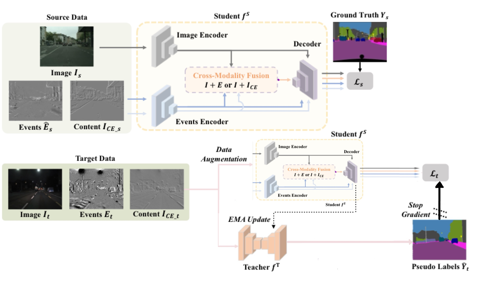
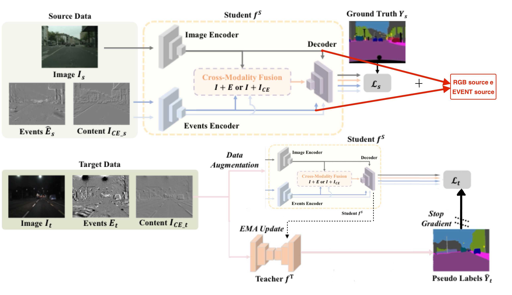
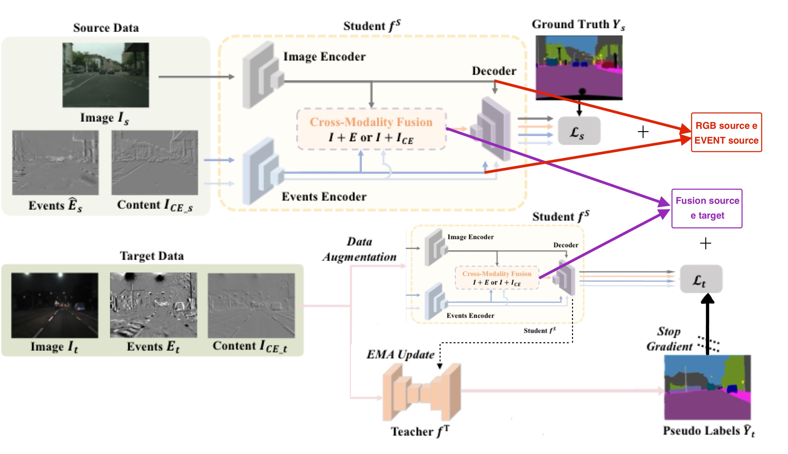
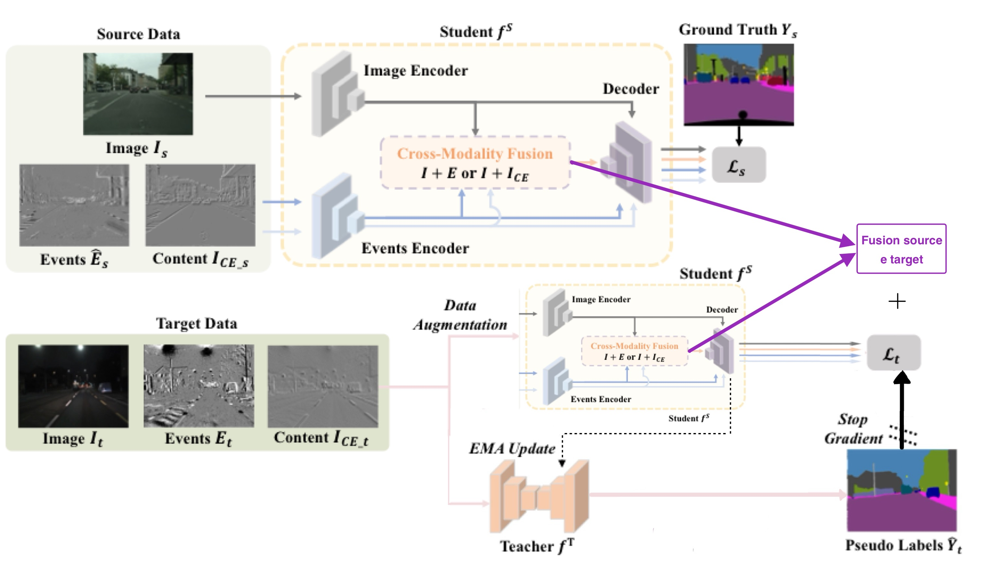
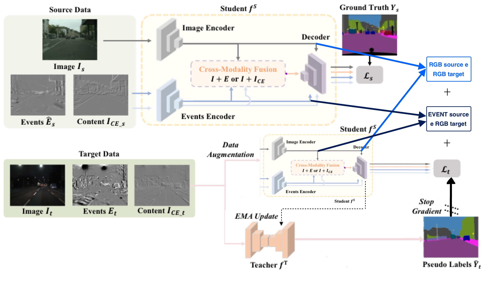
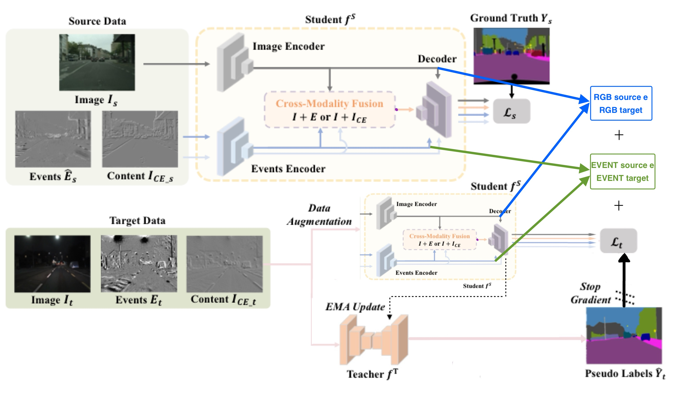

# **<span style="color:purple">A Study on CMDA (Cross-Modality Domain Adaptation) for Nighttime Semantic Segmentation Introducing Novel Feature Losses</span>**

**by Giovanni Stefanini and Maria Giovanna Donadio**

Original CMDA article written by Ruihao Xia, Chaoqiang Zhao, Meng Zheng, Ziyan Wu, Qiyu Sun, and Yang Tang.
**[[Arxiv]](https://arxiv.org/abs/2307.15942)**
**[[Paper]](https://arxiv.org/pdf/2307.15942.pdf)**


## Overview

Most studies on nighttime semantic segmentation rely on domain adaptation approaches and image inputs. However, limited by the low dynamic range of conventional cameras, images fail to capture structural details and edge information under poor lighting conditions.

Event cameras, as a new form of visual sensors, are complementary to conventional cameras due to their high dynamic range. To this end, the unsupervised Cross-Modality Domain Adaptation (CMDA) framework leverages multi-modality information (Images and Events) for nighttime semantic segmentation, using labels only on daytime images. Furthermore, it introduces the first image-event dataset for nighttime semantic segmentation.

The strengths of CMDA, compared to its predecessor state-of-the-art UDA method DAFormer, can be observed in the qualitative examples from the DSEC Night-Semantic dataset.


Even without the event modality, the Image Content Extractor effectively mitigates the impact of nighttime reflections, resulting in sharper edge segmentation for the sky and other objects.


## Our Contribution
Observing the positive performance achieved by CMDA, further experiments were conducted with the aim of further enhancing the capabilities of this framework.

The contribution of this work consists of introducing different variants of L2 loss applied to the features extracted during the CMDA training phase, with the goal of improving the quality of the final nighttime segmentation.

The **L2 losses** introduced in the different experiments and tested are as follows [RGB = ⚪, EVENT = ⬜, FUSION = 🤍]:

- <span style="color:red">L2 loss between  *RGB features source and EVENT features source*</span>. 🔴

- <span style="color:red">L2 loss between  *RGB features source and EVENT features source*</span> &&
  <span style="color:violet">L2 loss between  *FUSION features source and FUSION features target*</span>. 🔴💜

- <span style="color:violet">L2 loss between  *FUSION features source and FUSION features target*</span>. 💜

- <span style="color:skyblue">L2 loss between  *RGB features source and RGB features target*</span> &&
  <span style="color:blue">L2 loss between  *EVENT features source and RGB features target*</span>. 🔵🟦

- <span style="color:skyblue">L2 loss between  *RGB features source and RGB features target*</span> &&
  <span style="color:green">L2 loss between  *EVENT features source and EVENT features target*</span>. 🔵🟩

|  |  |  |
|:-------------------------------------------:|:-------------------------------------------:|:-------------------------------------------:|
|  |  |  |


## Files Modified for Experiments Compared to Original CMDA

The main files that were modified are:
- files for running the original CMDA baseline have the suffix **'_originale'** in their name.
- **'./my_run_experiments.py'** → modified to include the option to choose the backbone in the argparse.
- **'./experiments.py'** → modified to include all possible mit-b backbones and to change the batch_size from 2 (as used in the paper) to 1, in order to run on less powerful GPUs.
- **'./mmseg/models/uda/dacs.py'** →  to include the calculation of the L2 losses between the extracted features. All implemented L2 losses are inside, but those not used in the final experiment are commented out. This is the file executed during training. To change the experiment type, copy and paste the corresponding dacs file for the desired loss into this file (they have different names based on the experiment they implement).
- **'./configs/fusion/cs2dsec_image+events_together_b2.py'** → modified to include the 'lambda' parameters for the new losses. They should be commented or uncommented based on the experiment to be run.
- **'./configs/_base_/datasets/uda_cityscapes_day_to_dsec_night_512x512.py'** → only modified the samples_per_gpu and workers_per_gpu to make it functional.
- **'./my_test.py'** → slightly modified to facilitate testing.

\
The files containing the various experiment implementations that modify dacs.py are as follows [RGB = ⚪, EVENT = ⬜, FUSION = 🤍]:
- './mmseg/models/uda/dacs_originale.py'
- './mmseg/models/uda/dacs_L2_RGBst_L2_EVENTsRGBt.py' 🔵🟦
- './mmseg/models/uda/dacs_L2_RGBst_L2_EVENTst.py' 🔵🟩
- './mmseg/models/uda/dacs_solo_L2_sourcetarget_fusion.py' 💜
- './mmseg/models/uda/dacs_loss_L2_sourcedomain.py' 🔴


## Added Files
Added some files to be able to run with mit_b2:
- './configs/fusion/cs2dsec_image+events_together_b2.py'
- './configs/fusion/cs2dz_image+raw-isr_b2.py'
- './configs/_base_/models/daformer_conv1_mitb2.py'
- './configs/_base_/models/daformer_sepaspp_mitb2.py'

Furthermore, in the './grafici' directory, there are scripts and images used to generate loss plots from the training logs.

## Environment Setup

For this project, Python 3.8.5 was used. We recommend setting up a new virtual environment:
```shell
conda create -n CMDA-MG python=3.7
conda activate CMDA-MG
```

After activating the CMDA conda environment and cloning the repository, enter the CMDA folder with the command:
```shell
cd CMDA/
```

Subsequently, execute the following steps to install the requirements:
```shell
pip install -r requirements.txt -f https://download.pytorch.org/whl/torch_stable.html
pip install hdf5plugin
pip install mmcv-full==1.3.7 -f https://download.openmmlab.com/mmcv/dist/cu110/torch1.7.0/index.html # requires the other packages to be installed first
```

Additionally, manually download the pretrained backbones. \
If you want the backbone used in the original paper, download `mit_b5.pth` [MiT-B5](https://drive.google.com/file/d/1TwUh8H9flg-zUHZmq7vu-FtyaSMrf9oq/view?usp=sharing). \
If you want the backbone used by us for the study of the enhancing losses, download `mit_b2.pth` [MiT-B2](https://drive.google.com/drive/u/0/folders/1lnm-omyRB3ZCfpMu5zJPgZT21zQg80RM) from the drive where we collected all the found pretrained models.

Also download the style transfer network `cityscapes_ICD_to_dsec_EN.pth` 
[here](https://drive.google.com/file/d/10ZG_fiCvfnhNNppSdPtQhUL9XPTBSIEF/view?usp=sharing). 


Finally, place the backbones and the style transfer network inside a pretrained/ folder within the project.


## Dataset Configuration

**Cityscapes:** 

① Please download leftImg8bit_trainvaltest.zip and
gt_trainvaltest.zip from [here](https://www.cityscapes-dataset.com/downloads/)
and extract them in`data/cityscapes`.

② Please download `leftImg8bit_IC1` from [here](https://drive.google.com/file/d/19474kcmbyz8WRBBez29MOINeQT1yMZyZ/view?usp=sharing) 
and extract it in `data/cityscapes`.

③ Finally, please run the following scripts to convert label IDs to train IDs and to generate the class index for RCS.

```shell
python tools/convert_datasets/cityscapes.py data/cityscapes --nproc 8
```

Note that it might be necessary to modify the directories within the project files to match the relative paths and working directories.

**DSEC Night_Semantic:** 

The dataset proposed in CMDA, DSEC Night_Semantic, consists of 5 nighttime sequences of Zurich City 09a-e and includes 1.692 training samples and 150 test samples. For each test sample, they manually annotated 18 classes: Road, Sidewalk, Building, Wall, Fence, Pole, Traffic Light, Traffic Sign, Vegetation, Terrain, Sky, Person, Rider, Car, Bus, Train, Motorcycle, and Bicycle.

① S Please download events_left.zip and images_rectified_left.zip for `zurich_city_09_a~09_e` from
[here](https://dsec.ifi.uzh.ch/dsec-datasets/download/) 
and extract them in `data/DSEC_Night/zurich_city_09_x/events(images)`.

② Please download the `labels` and `warp_images` from
[here](https://drive.google.com/file/d/1LWinkZXUWKBzl946wxhLKaHbOOIP-hRi/view?usp=sharing) 
and extract them in `data/DSEC_Night/zurich_city_09_x`.

③ Finally, run the following scripts to generate night_dataset_warp.txt and night_test_dataset_warp.txt for the DSEC DataLoader.
```shell
python create_dsec_dataset_txt.py --root_dir /path_to_CMDA/CMDA/data/DSEC_Night/
```

④ (Optional) The authors of CMDA modified the interpolation function in the warping process to obtain more realistic matched images. You can download version V2 [here](https://drive.google.com/file/d/1BgYqQj97TBNJuqVnrbQcfKL3jjwQp5h2/view?usp=sharing). 
Note that the results in their paper were obtained on the V1 version of their dataset.

**DarkZurich (Opzionale):** 

Please download Dark_Zurich_train_anon.zip and Dark_Zurich_val_anon.zip from
[here](https://www.trace.ethz.ch/publications/2019/GCMA_UIoU/) and extract them in `data/dark_zurich`.

```shell
python tools/convert_datasets/cityscapes.py data/cityscapes --nproc 8
```

The folder structure of the data should be as follows:

```none
CMDA
├── ...
├── data
│   ├── cityscapes
│   │   ├── gtFine
│   │   │   ├── ...
│   │   ├── leftImg8bit
│   │   │   ├── ...
│   │   ├── leftImg8bit_IC1
│   │   │   ├── ...
│   │   ├── sample_class_stats_dict.json
│   │   ├── sample_class_stats.json
│   │   ├── samples_with_class.json
│   ├── DSEC_Night
│   │   ├── zurich_city_09_a
│   │   │   ├── events
│   │   │   │   ├── left
│   │   │   │   │   ├── events.h5
│   │   │   │   │   ├── rectify_map.h5
│   │   │   ├── images
│   │   │   │   ├── left
│   │   │   │   │   ├── rectified
│   │   │   │   │   │   ├── xxxxxx.png
│   │   │   │   │   │   ├── ...
│   │   │   │   │   ├── exposure_timestamps_left.txt
│   │   │   │   ├── images_to_events_index.txt
│   │   │   │   ├── timestamps.txt
│   │   │   ├── labels
│   │   │   │   ├── zurich_city_09_x_xxxxxx_grey_gtFine_labelTrainIds.png
│   │   │   │   ├── ...
│   │   │   ├── warp_images
│   │   │   │   ├── xxxxxx.png
│   │   │   │   ├── ...
│   │   ├── zurich_city_09_b~e
│   │   │   ├── ...
│   ├── dark_zurich
│   │   ├── gt
│   │   │   ├── ...
│   │   ├── rgb_anon
│   │   │   ├── ...
├── ...
```

## Training

**Cityscapes→DSEC_Night:** 

To run experiments modifying only the backbone (from mit_b5 to mit_b2) compared to the original code, files with the suffix '_originale' in their name were created, in order to differentiate them from those modified to introduce the losses.

To run experiments that do NOT use the introduced losses, but only use the mit_b2 backbone instead of mit_b3, the command to execute is:
```shell
python my_run_experiments_originale.py --root_path ./ --base_config configs/fusion/cs2dsec_image+events_together_b2_originale.py --name cmda_cs2dsec --backbone mit_b2
```

To run our experiments that utilize the introduced losses, the command is:
```shell
python my_run_experiments.py --root_path ./ --base_config configs/fusion/cs2dsec_image+events_together_b2.py --name cmda_cs2dsec --backbone mit_b2
```

Note that we modified the batch_size inside experiments.py (using batch_size=1 instead of batch_size=2).

Note that you can modify the training dimensions by adding: --train_size 400-400


## Testing & Predictions

**Cityscapes→DSEC_Night:** 

Testing and predictions are automatically performed after training and do not require additional steps.

The CMDA checkpoint trained on Cityscapes→DSEC_Night can be tested on the DSEC_Night testset using:

```shell
python my_test.py --work_dir ./work_dirs/local-basic/nome_della_directory_creata_con_il_train
```


## Checkpoints

The checkpoints and logs produced by our experiments on Cityscapes→DSEC are available at the following GDrive link:
* [CMDA for Cityscapes→DSEC](https://drive.google.com/drive/u/0/folders/13vdrbKVXYU4r6A6VnAaYhk9odQWPJyh6)


Note that checkpoints are produced after training in the '/work_dir' folder, including the training logs. Please also note that:

* ⚠ The logs provide the mIoU for 19 classes. For Cityscapes→DSEC, it is necessary to convert the mIoU to the 18 valid classes, i.e., for example, the final mIoU of 56.89 should be converted to 56.89*19/18=60.05.

## Acknowledgements

Like its predecessor CMDA, this project is based on the following open-source projects. We thank their authors for making the code publicly available. 

* [CMDA](https://github.com/XiaRho/CMDA)
* [DAFormer](https://github.com/lhoyer/DAFormer)
* [CycleGAN](https://github.com/junyanz/pytorch-CycleGAN-and-pix2pix)
* [MMSegmentation](https://github.com/open-mmlab/mmsegmentation)
* [SegFormer](https://github.com/NVlabs/SegFormer)
* [DACS](https://github.com/vikolss/DACS)

Furthermore, we wish to express our gratitude to the researchers and PhD students at [MICC](https://www.micc.unifi.it/) for their constant availability, patience, and support in clarifying our doubts and helping us overcome the various difficulties encountered. In particular, a heartfelt thank you to:

- Niccolò Biondi
- Federico Becattini
- Gabriele Magrini
- Lorenzo Berlincioni

A special thanks also goes to our trusted companion ***harlock*** ... you were the best dream machine we could wish for!
